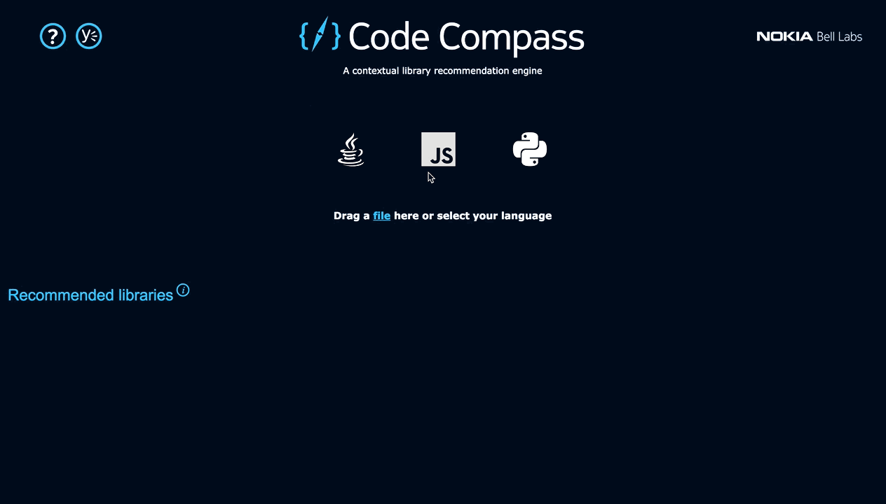
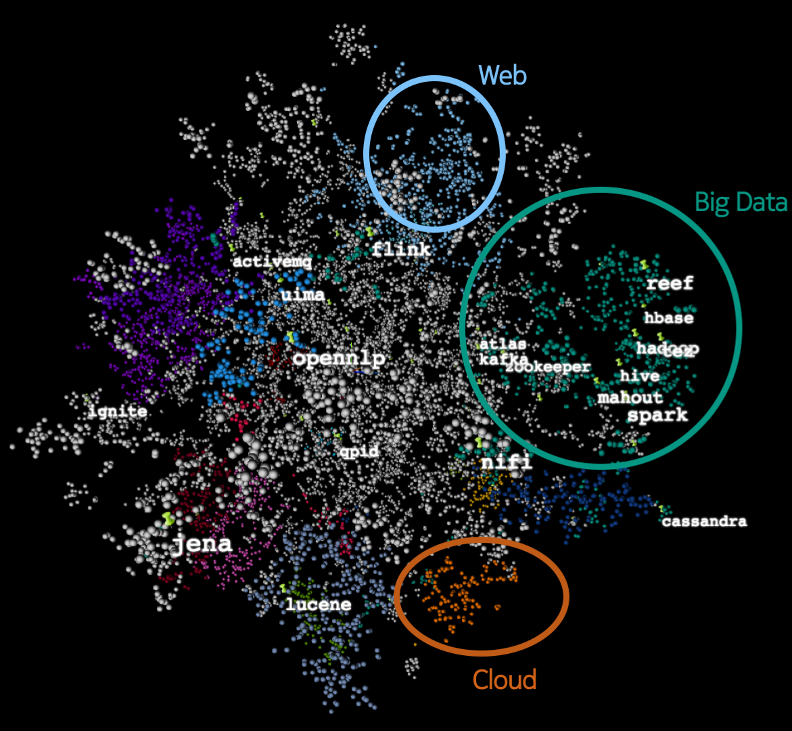

[Code Compass](https://www.bell-labs.com/code-compass) is a contextual search engine for software packages developed at [Nokia Bell Labs](https://www.bell-labs.com). It supercharges code reuse by recommending the best possible software libraries for your specific software project. See for yourself:

Code Compass is available as a [website](https://www.bell-labs.com/code-compass), a [REST API](https://www.code-compass.com/apidoc/) and as an [IDE plug-in](https://marketplace.visualstudio.com/items?itemName=NokiaBellLabs.code-compass) for vscode.

We index packages hosted on [NPM](https://www.npmjs.com) for JavaScript, [PyPI](https://pypi.python.org) for Python and [Maven Central](https://mvnrepository.com/) for Java.

If you're looking for the similarly named code comprehension tool from Ericsson to explore large codebases, [look here](https://github.com/Ericsson/CodeCompass). Apart from the name, there is no relationship (formal or informal) between that project and this one.

# Why?

Modern software development is founded on code reuse through open source libraries and frameworks. These libraries are published in software package repositories, which [are growing](https://www.modulecounts.com) at an exponential rate. By building better software package search tools we aim to stimulate more code reuse and make software packages in the "long tail" more discoverable.

A gentle introduction to the why, what and how of Code Compass can be found in this [introductory blog post](https://www.code-compass.com/blog/intro).

# What?

Code Compass is a contextual search engine for software packages. 

Code Compass differs from other package search engines in that you can "seed" the search with names of libraries that you already know or use. We call these "context libraries". Code Compass then uses these context libraries to "anchor" the search in those technology stacks that are most relevant to your code.

When using the Visual Studio Code IDE extension there is no need to manually enter context libraries: Code Compass will automatically extract the import dependencies of the active source file to anchor its search.

Note that Code Compass will never send your code to the server. Only the names of third-party modules imported in your code are sent.

# How?

Code Compass uses unsupervised machine learning to learn how to cluster similar software packages by their context of use, as determined by how libraries get imported alongside other libraries in large open source codebases.

Software packages are represented as vectors which we call "library vectors" by analogy with [word vectors](https://blog.acolyer.org/2016/04/21/the-amazing-power-of-word-vectors/). Just like [word2vec](https://code.google.com/archive/p/word2vec/) turns words into vectors by analyzing how words co-occur in large text corpora, our "import2vec" turns libraries into vectors by analyzing how import statements co-occur in large codebases.

You can read the details in [our MSR 2019 paper](https://arxiv.org/abs/1904.03990). Supplementary material including trained library embeddings for Java, JavaScript and Python is available on [Zenodo](https://zenodo.org/record/2546488).

As an example, for Java we looked at a large number of open source projects on [GitHub](https://github.com) and libraries on [Maven Central](https://mvnrepository.com/) and studied how libraries are imported across these projects. We identified large clusters of projects related to web frameworks, cloud computing, network services and big data analytics. Well-known projects such as [Apache Hadoop](http://hadoop.apache.org/), [Spark](https://spark.apache.org/) and [Kafka](https://kafka.apache.org/) were all clustered into the same region because they are commonly used together to support big data analytics.

Below is a 3D visualization (a [t-SNE](https://lvdmaaten.github.io/tsne/) plot) of the learned vector space for Java. Each dot represents a Java library and the various colored clusters correspond to different niche areas that were discovered in the data. We highlighted the names of [Apache projects](https://projects-new.apache.org/projects.html).

# What's in this repo?

  * `docs/`: REST API docs for the Code Compass search service
  * `plugins/vscode/`: Visual Studio Code extension to integrate Code Compass into the IDE
  * `scripts/`: data extraction scripts to generate library import co-occurrences from source code
  * `nbs/`: Jupyter notebooks with TensorFlow models to train library embeddings from import co-occurrence data

# Team

Code Compass is developed by a research team in the [Application Platforms and Software Systems](https://www.bell-labs.com/our-research/areas/applications-and-platforms/) Lab of [Nokia Bell Labs](https://www.bell-labs.com).

See [CONTRIBUTORS](./CONTRIBUTORS) for an alphabetic list of contributors to Code Compass.

# Contributing

If you would like to train embeddings for other languages, have a look at the scripts under `import2vec` to get an idea of what data is required.

If you have suggestions for improvement, user feedback or want to report a bug, please open an issue in this repository.

# License

BSD3
